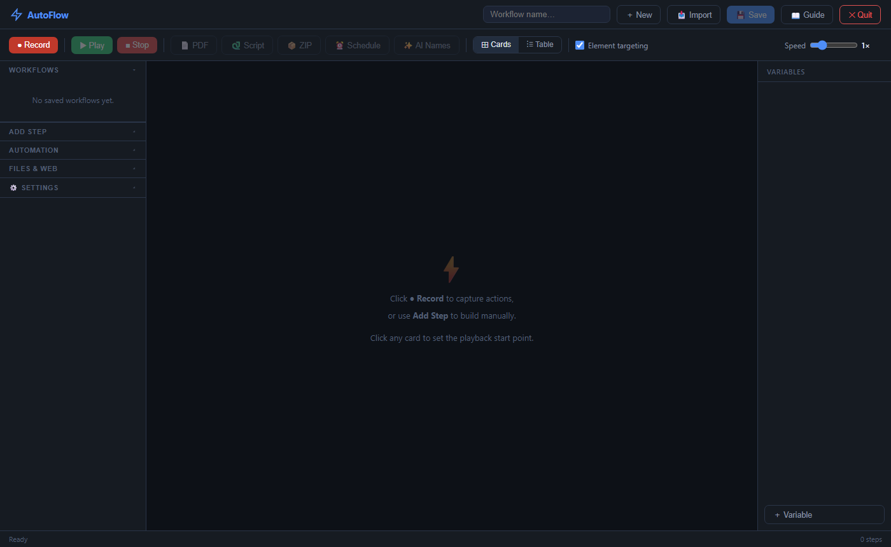
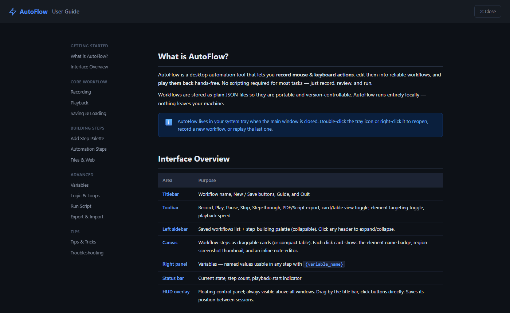

<div align="center">

# AutoFlow
**Record, edit, and replay desktop automation workflows on Windows**

[](https://github.com/ChrisMangin/AutoFlow)
[](https://github.com/ChrisMangin/AutoFlow)
[](https://github.com/ChrisMangin/AutoFlow/releases/latest)
[](LICENSE)

<br>

</div>

AutoFlow is a **standalone Windows app** (no install, no Python, no runtime) that lets you record mouse and keyboard actions, edit them into reliable workflows, and play them back hands-free — with a clean dark UI, a floating HUD overlay, and a full built-in guide.

> **v2.0.0** — Rewritten in Rust. **3.1 MB** single EXE, instant startup, no dependencies.


## Screenshots

<table>
<tr>
  <td></td>
  <td></td>
</tr>
<tr>
  <td align="center"><em>Main canvas — toolbar, step palette, and variables panel</em></td>
  <td align="center"><em>Built-in User Guide with sidebar navigation</em></td>
</tr>
</table>


## Features

### Recording
- **Global F9 hotkey** — start and stop recording from anywhere, no need to click back to the browser
- Captures mouse clicks (with UI Automation element names and AutomationIds), keystrokes, hotkeys, and scroll events across the entire desktop — including Win32 apps, browsers, file explorers, and terminals
- **Smart context detection** — auto-inserts a Navigate step for browser sessions or an Open App step for desktop apps
- Consecutive scrolls at the same position are merged automatically; typed characters batch into a single Type step
- **Region screenshot thumbnails** captured per click with a visual target circle overlay

### HUD Overlay
- Frameless floating panel always visible above all windows; drag to reposition, position is remembered between sessions
- Buttons send commands directly to the recorder — bypasses HTTP for instant response even while the hook thread is active
- Hides automatically when the last browser tab closes

### Editing
- **Drag-and-drop reorder** in card view; compact table view for dense workflows
- Full edit modal for every step type
- **Disable steps** — skip without deleting; shown struck-through in PDF/script exports
- **Undo delete** — `Ctrl+Z` restores the last deleted step (up to 10 deep)
- **AI step naming** — `✨ AI Names` button renames steps via local Ollama (`qwen3:8b`)
- Per-step notes with inline editor; notes appear in PDF export
- Unsaved-change indicator: Save button pulses blue, title bar shows `●`

### Playback
- Start from any step; step-through mode advances one step at a time
- Adjustable speed: 0.25× to 4×
- **Smart window-ready check** before every click — waits for the target window to respond before acting
- Three-level click fallback: UI element name/AutomationId → window-relative offset → absolute coordinates
- Recursive **Run Workflow** step — chain workflows together

### Step Types (25+)
Click, Type, Hotkey, Scroll, Wait, Navigate, Launch Browser, Wait for Element, Wait for Window,
Screenshot, Show Message, Get/Set Clipboard, Image Click, Open File/App, Read/Write/Copy/Move/Delete File,
HTTP Request, Kill Process, Close Window, Play Sound, Loop, If/Else, Set Variable, Run Script, Comment, Run Workflow

### Export
- **PDF report** — steps, notes, and screenshots; use as a walkthrough or SOP
- **Python script** — standalone `pyautogui` script for all step types
- **ZIP package** — script + `run.bat` + `requirements.txt`
- **Task Scheduler XML** — `⏰ Schedule` button exports a ready-to-import Windows Task Scheduler package

### Quality of Life
- **System tray** — minimize to tray, reopen, record new, or replay last
- Workflows stored as portable JSON in `%APPDATA%\AutoFlow\workflows\`
- Two-click delete confirmation — click ✕, button turns red showing "Delete?" for 3.5s, click again to confirm
- Runs **100% locally** — nothing is sent over the internet


## Quick Start

### Option 1 — Standalone EXE (Windows, no install needed)

1. Download **`autoflow.exe`** from the [latest release](https://github.com/ChrisMangin/AutoFlow/releases/latest)
2. Double-click it — a browser tab opens automatically at `http://127.0.0.1:7878`
3. Click **● Record**, do your actions, press **F9** or click **■ Stop**

The server auto-exits when the last browser tab is closed.

### Option 2 — Build from Source

Requires [Rust](https://rustup.rs/) 1.70+.

```sh
git clone https://github.com/ChrisMangin/AutoFlow
cd AutoFlow
cargo build --release
# EXE at: target/release/autoflow.exe
```


## Keyboard Shortcuts

| Shortcut | Action |
|----------|--------|
| `F9` | Start / stop recording (global — works from any app) |
| `Ctrl+R` | Start / stop recording (browser must be focused) |
| `Ctrl+P` | Play workflow |
| `Ctrl+S` | Save workflow |
| `Esc` | Stop playback or recording |
| `Ctrl+Z` | Undo last deleted step (up to 10 deep) |


## Project Layout

```
AutoFlow/
├── Cargo.toml
├── src/
│   ├── main.rs          entry point — port binding, duplicate-instance guard, tray setup
│   ├── server.rs        axum HTTP + WebSocket server, all API routes
│   ├── state.rs         thread-safe app state (steps, variables, status)
│   ├── recorder.rs      Win32 low-level mouse/keyboard hook, UIA element detection
│   ├── player.rs        async workflow playback engine, smart window-ready checks
│   ├── hud.rs           Win32 HUD overlay window, F9 global hotkey
│   ├── tray.rs          system tray icon and menu
│   ├── export.rs        PDF, Python script, ZIP, and Task Scheduler XML export
│   ├── ws.rs            WebSocket broadcast helpers
│   └── embedded.rs      rust-embed static asset server
└── static/
    ├── index.html       app shell
    ├── style.css        dark UI theme
    ├── app.js           all UI logic (~1 300 lines, no build step)
    ├── ws.js            WebSocket client
    └── guide.html       built-in user guide
```


## Tech Stack

| Layer | Technology |
|-------|-----------|
| HTTP + WebSocket server | [axum](https://github.com/tokio-rs/axum) 0.7 + tokio |
| Win32 / UIA / COM | [windows-rs](https://github.com/microsoft/windows-rs) 0.58 |
| Image encoding | [image](https://github.com/image-rs/image) (JPEG thumbnails) |
| Frontend embedding | [rust-embed](https://github.com/pyros2097/rust-embed) |
| Tray icon | [tray-icon](https://github.com/tauri-apps/tray-icon) |
| Frontend | Vanilla HTML / CSS / JS — no framework, no build step |


## License

MIT — see [LICENSE](LICENSE).
